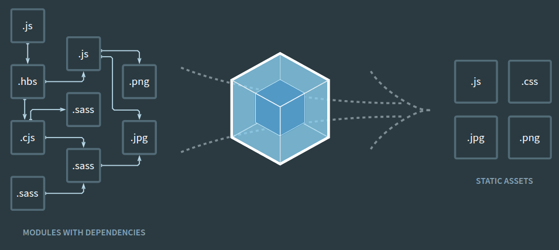

# Notas sobre o curso de Node

## Mobile First


Why mobile first?
- Revolution in way people use internet: more traffic from mobile devices than from laptops/desktops
- Traditional "Desktop first" responsive design resulted in bloated, slow-loading websites (i.e huge image files)

### Design x Development Context

From a design perspective it means:
- Designing around a smaller screen first 
- Small screen size forces us to prioritize our content
- There's need to anticipate most common user actions

From a development perspective it means:
- Coding the website so devices don't download unnecessary data
- Treating the most essential view of the website as our baseline and code upwards from there
- Making the site load quickly for everyone

### Where do we begin?

#### CSS in a mobile-first way
Adjust font and image sizes to smartphone screen sizes

Using media queries:
```sh
&__title {
    ...
    font-size: 1.1rem;

    @media (min-width: 530px){
        font-size: 4.8rem;
    }
}
```
But @media is reusable. So we don't want to put it inside our CSS file directly.We can use PostCSS Mixins:
```sh
@define-mixin atSmall {
    @media (min-width: 530px) {
        @mixin-content;
    }
}
```

And at the CSS file:
```sh
&__title {
    ...
    font-size: 1.1rem;

    @mixin atSmall {
        font-size: 4.8rem;
    };
}        

```

#### Responsive Images
Traditional Images:
- Aspect ratio may not be good for smaller screens. Squares are more ideal for small screens
- Large desktop images may require way more data than what would be enough for small smartphone screens

We need to send different image files to different screen sizes. Aspects to consider:
- Art direciton and croping situation
- Image Resolution and File Size situation

Note: by default, browsers treat images as inline elements (similar to texts)

## Webpack

Webpack (https://webpack.js.org/) is a Node.JS module bundler for packages our website depends on (such as styles -- CSS, assets, scripts) in a way that is easy for visitors to consume.
It lets you do all sorts of automations, such as automatic HTML reload, on the fly changes to CSS and JS



### Automatic browser refreshing 

Using webpack serve

webpack.config.js snippet:
```sh
module.exports = {
    ...
    devServer: {
        before: function(app,server){
            server._watch('./app/**/*.html')
        },
        contentBase: path.join(__dirname, 'app'),
        hot: true,
        port: 3000,
        host: '0.0.0.0'
    },
```
server._watch 
- reload html page when any changes to html files are made
- It is performing full page reload

hot (hot module replacement)
- Inject new CSS/JS into browser's memory on the fly 
- Does not refresh/reload

host (localhost)
- will make page accessible to clients in same network via host's local IP Address, just as we access it via localhost

Note: webpack serve creates webpack output file (i.e bundled.js) in memory not in disk

## CSS Architecture

### CSS Basics

#### Font Size
HTML default font size (which is usually 16 pixels on most browsers)
'rem' is calculated in respect to that, so it adjusts page to user preferences 

### BEM 

B = Block: independent, reusable part of our design (like the large hero section our features in features section or testmonials in testmonials section)
```sh
<div class="[block-name]">
```

E = Element: belongs to a block, cannot be used outside that block (like a title/subtitle)
```sh
<div class="[block-name]__[element-name]">
```

M = Modifier: class that can be used on block or element. Indicate change on default state
```sh
<div class="[block-name] [block-name]--[modifier-rule-name]">
```

Important concepts:
- CSS selectors should target elements directly, instead of relying on type selectors, descendent selectores and the cascade
- Because we are limiting cascade, we are gree to move blocks around and reuse them throughout the page
- Blocks can be nested inside other blocks
- Idea is to identify patterns and then create single-responsability blocks that can be reused (no need to code patterns more than once)
- Makes the relationship between HTML and CSS clear (enhance maintainability)

Why extra classes with presentational names is not making HTML less semantic?

*Note: what is semantic HTML?

- Classes cannot be unsemantic
- Content-layer semantics are already served by HTML elements
- Class names impart little or no useful semantics to machines or human visitors
- THe primary purpose of a class name is to be a hook for CSS and Javascript
- Class names should communicate useful information to developers

#### Traditional Nesting

Conceptual Organization
On the 'large hero' example, the large hero is the block and examples of elements would be title and subtitle.
So class names become, for example 'large-hero__title'.
In traditional CSS design, nesting would be  

```sh
.large-hero{
    position: relative;
}

.large-hero__text-content{
    position: absolute;
    top: 50%;
    transform: translateY(-50%);
    left: 0;
    width: 100%;
    text-align: center;
}

.large-hero__title {
    font-weight: 300;
    color: #2f5572;
    font-size: 4.8rem;
}

.large-hero__subtitle {
    font-weight: 300;
    color: #2f5572;
    font-size: 2.9rem;
}
```
To

```sh
.large-hero{
    position: relative;

    .large-hero__text-content{
        position: absolute;
        top: 50%;
        transform: translateY(-50%);
        left: 0;
        width: 100%;
        text-align: center;
    }      

    .large-hero__title {
        font-weight: 300;
        color: #2f5572;
        font-size: 4.8rem;
    }   

    .large-hero__subtitle {
        font-weight: 300;
        color: #2f5572;
        font-size: 2.9rem;
    }

}
```

But in compiling, this would lead to descendent selectors:

```sh
.large-hero{
    position: relative;
}

.large-hero .large-hero__text-content{
    position: absolute;
    top: 50%;
    transform: translateY(-50%);
    left: 0;
    width: 100%;
    text-align: center;
}  

...
```

#### PostCSS Nesting Feature

Instead, we can use PostCSS nesting feature as follow:
```sh
.large-hero{
    position: relative;

    &__text-content{
        position: absolute;
        top: 50%;
        transform: translateY(-50%);
        left: 0;
        width: 100%;
        text-align: center;
    }

    &__title {
        font-weight: 300;
        color: #2f5572;
        font-size: 4.8rem;
    }

    &__subtitle {
        font-weight: 300;
        color: #2f5572;
        font-size: 2.9rem;
    }
}
```

That will lead to:

```sh
.large-hero{
    position: relative;
}

.large-hero__text-content{
    position: absolute;
    top: 50%;
    transform: translateY(-50%);
    left: 0;
    width: 100%;
    text-align: center;
}

.large-hero__title {
    font-weight: 300;
    color: #2f5572;
    font-size: 4.8rem;
}

.large-hero__subtitle {
    font-weight: 300;
    color: #2f5572;
    font-size: 2.9rem;
}
```

#### Modifiers


